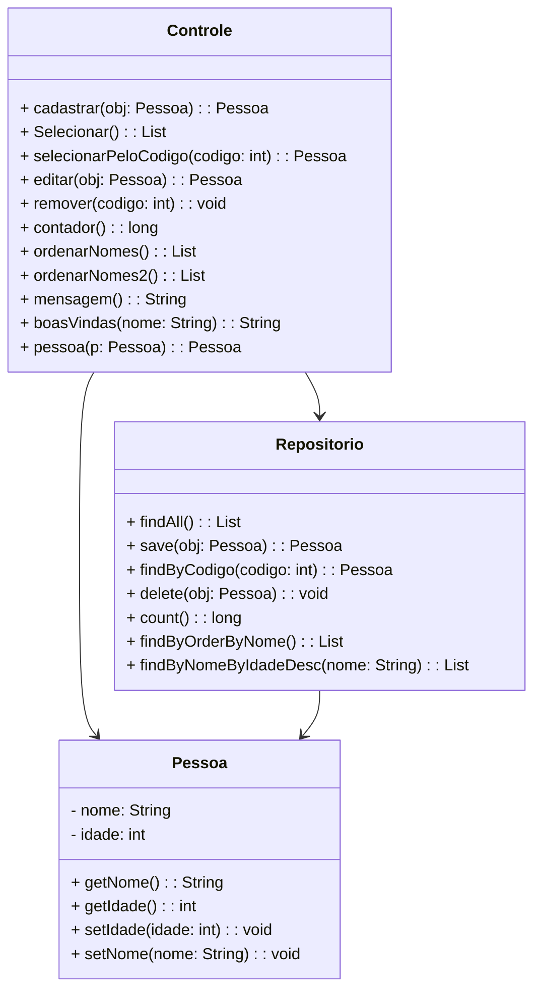

# Projeto API de Gerenciamento de Pessoas
Este é um projeto de exemplo de uma API em Spring Boot que gerencia informações de pessoas. Ele fornece endpoints para cadastrar, editar, remover e listar pessoas, bem como operações adicionais, como contagem e ordenação. Além disso, há endpoints de boas-vindas que retornam mensagens de saudação.

## Estrutura do Projeto
O projeto é composto por várias classes Java que se relacionam entre si para criar a funcionalidade da API. Abaixo estão as classes envolvidas no projeto:

### Controle.java
Esta classe é um controlador Spring Boot que define os endpoints da API e implementa as operações CRUD (Criar, Ler, Atualizar, Excluir) para objetos do tipo Pessoa.

### Pessoa.java
Esta classe é um modelo que representa uma pessoa. Ela possui atributos como nome e idade, além de métodos getters e setters para acessar e modificar esses atributos.

### Repositorio.java
Esta é uma interface de repositório que estende CrudRepository. Ela define métodos para realizar operações de consulta no banco de dados, como buscar todas as pessoas, salvar uma pessoa, buscar uma pessoa por código, contar o número de pessoas, ordenar por nome, e filtrar por nome e idade.

### ApiApplication.java
Esta classe é a classe principal que inicia a aplicação Spring Boot.

## Endpoints da API
A API possui os seguintes endpoints:

POST /api: Cadastra uma nova pessoa.
GET /api: Lista todas as pessoas cadastradas.
GET /api/{codigo}: Retorna os detalhes de uma pessoa com base no código.
PUT /api: Edita os detalhes de uma pessoa existente.
DELETE /api/{codigo}: Remove uma pessoa com base no código.
GET /api/contador: Retorna o número total de pessoas cadastradas.
GET /api/ordenarNomes: Lista as pessoas em ordem alfabética por nome.
GET /api/ordenarNomes2: Lista as pessoas cujo nome seja "Gisela" em ordem decrescente de idade.
GET /boasVindas: Retorna uma mensagem de boas-vindas genérica.
GET /boasVindas/{nome}: Retorna uma mensagem de boas-vindas personalizada com o nome.

## Executando o Projeto
Para executar o projeto, siga estas etapas:

Certifique-se de ter o ambiente de desenvolvimento Spring Boot configurado.

Clone o repositório do GitHub.

Importe o projeto em sua IDE.

Execute a classe ApiApplication.java para iniciar a aplicação Spring Boot.

Acesse a API por meio dos endpoints mencionados anteriormente.

Fique à vontade para modificar o projeto conforme suas necessidades e adicionar mais funcionalidades à API de gerenciamento de pessoas.

